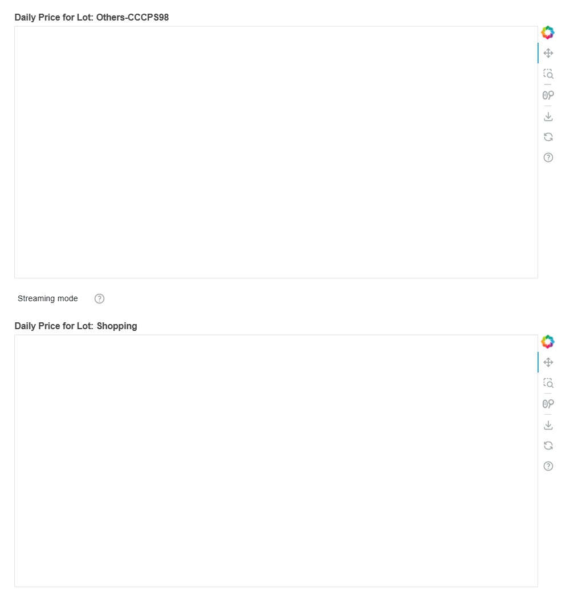

# Dynamic Pricing for Urban Parking Lots - Final Capstone Project - Summer Analytics

This project on Dynamic Pricing for Urban Parking Lots was completed as part of the Summer Analytics course conducted by [CAIITG](https://www.caciitg.com/). The goal was to model dynamic price adjustments for urban parking spots based on features like occupancy, capacity, queue length, traffic conditions, and special days. Along with basic data exploration and visualization, two pricing models were developed:

1. **Simple Linear Model** - Price depends linearly on the occupancy level of the parking lot.
2. **Demand-Based Pricing Function** - A non-linear function designed to capture more complex patterns in demand over time.

  

------

**Data Source:** 
1. Time-series data of 14 different parking lot conditions recorded at several times a day over 73 days - [Dataset Source](https://drive.google.com/file/d/1RqHF3zphAFOtYZgReDJUxEFweOiVAxqP/view?usp=drive_link) 

------

**Code Files:**
1. Data Exploration & Simple Linear Model - [Link (Google Colab)](https://colab.research.google.com/drive/15VvM2MK1v1yaspyF4U4ogplul_p5XAYt?usp=sharing) 
2. Demand-based Pricing Model - [Link (Google Colab)](https://colab.research.google.com/drive/10b_NcppLcWKH_iIzXMsufVKUejGfeVgl?usp=sharing) 

ℹ️ Required justification for the simple linear model structure has been provided in Google Colab. 

-------
**Tech Stack & Python Libraries Used:**
1. Python
2. Google Colab
3. Pathway
4. Pandas
5. Numpy
6. Bokeh
7. Matplotlib
